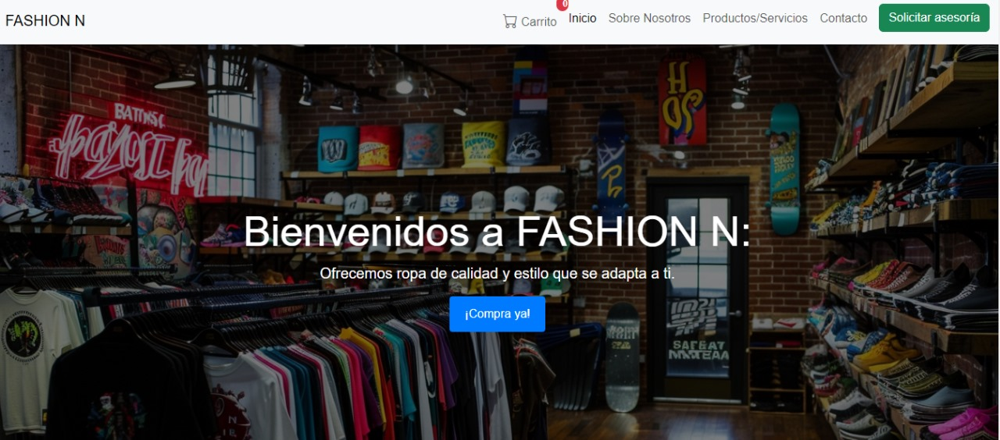
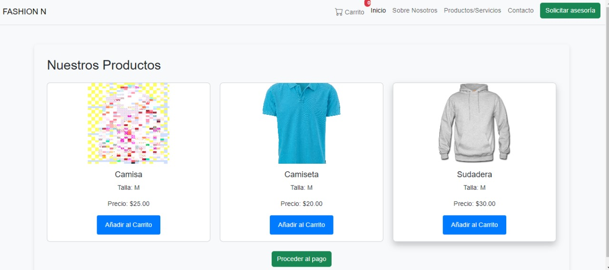
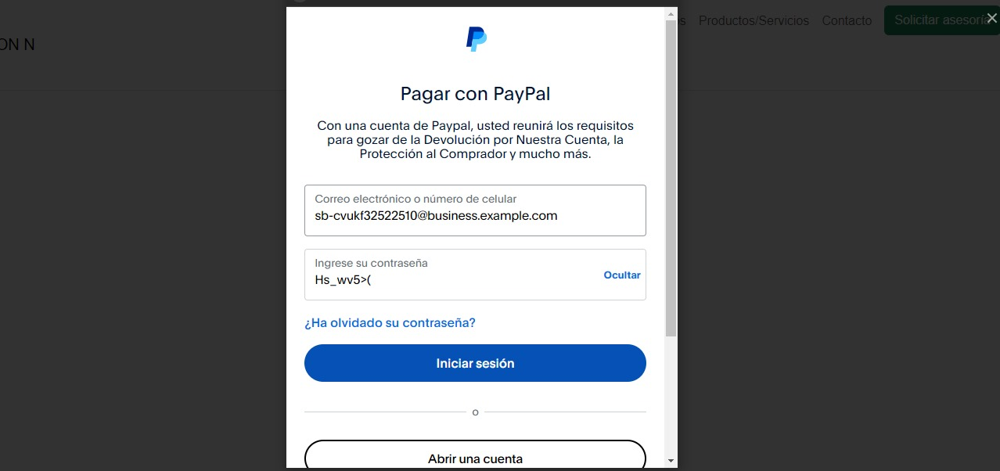
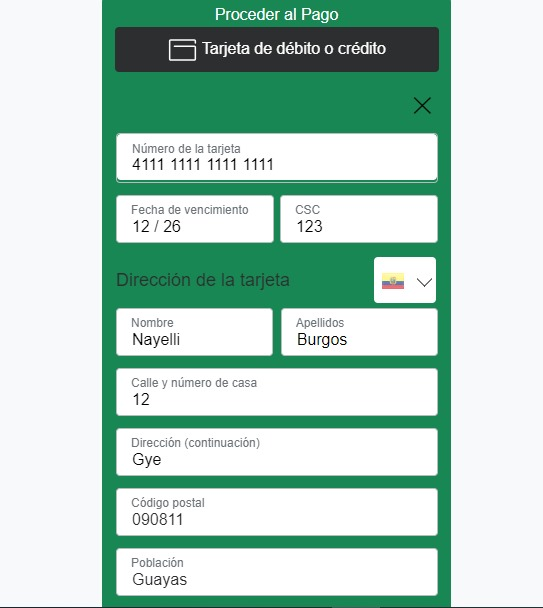

# Pasarela de Pagos - Proyecto de Fashion N
Implementación de pasarela de pago simulada en la página web de Fashion N.

## Integración de la Pasarela de Pago
Para integrar la pasarela de pago simulada a la página web de Fashion N, se utilizó la función de botones de pago de PayPal. La implementación se encuentra en el archivo denominado carrito.html, que contiene el botón de pago con PayPal integrado para el proceso de checkout.

## Implementación
El botón de PayPal se integra en la página carrito.html, y la simulación de pago está configurada con la sandbox de PayPal. Puedes encontrar la integración en la sección de código correspondiente al botón de pago en el archivo carrito.html.

## Datos de Prueba
Para simular un pago exitoso con PayPal, asegúrate de estar en el entorno sandbox de PayPal, donde puedes usar las credenciales de prueba proporcionadas por PayPal. Aquí están los datos de prueba recomendados para la simulación:

Correo electrónico de prueba: 
# sb-cvukf32522510@business.example.com
Contraseña de prueba: 
## Hs_wv5>(

Número de tarjeta: ## 4111 1111 1111 1111
Fecha de vencimiento: ## cualquier fecha futura
CVV: ## cualquier número de 3 dígitos        
Estos datos te permitirán realizar pagos simulados sin procesar transacciones reales.

## Previsualización
A continuación, se presentan imágenes relacionadas con el ejemplo dado que simula una página web de comercio electrónico con integración de PayPal.

## Página principal

## Página del Carrito (Implementación del botón de PayPal)

## Simulación de Pago con PayPal

## Simulación de Pago con Tarejta de Credito

## Gracias por visitar mi proyecto 😃

